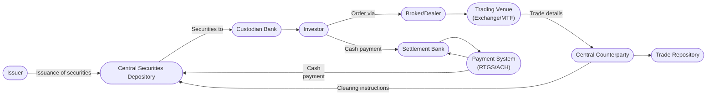

```mermaid
flowchart LR
  Issuer(["Issuer"])
  Investor(["Investor"])
  Broker(["Broker/Dealer"])
  TradingVenue(["Trading Venue<br/>(Exchange/MTF)"])
  CCP(["Central Counterparty"])
  CSD(["Central Securities Depository"])
  Custodian(["Custodian Bank"])
  SettlementBank(["Settlement Bank"])
  PaymentSystem(["Payment System<br/>(RTGS/ACH)"])
  TradeRepo(["Trade Repository"])

  Issuer -->|Issuance of securities| CSD
  Investor -->|Order via| Broker
  Broker --> TradingVenue
  TradingVenue -->|Trade details| CCP
  CCP -->|Clearing instructions| CSD
  CSD -->|Securities to| Custodian
  Custodian --> Investor
  Investor -->|Cash payment| SettlementBank
  SettlementBank --> PaymentSystem
  PaymentSystem --> SettlementBank
  PaymentSystem --> |Cash<br>payment| CSD
  CCP --> TradeRepo

```
