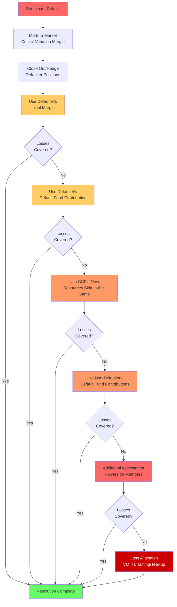

```mermaid
graph TD
    START[Participant Default]
    START --> VM[Mark-to-Market<br/>Collect Variation Margin]
    VM --> CLOSE[Close Out/Hedge<br/>Defaulter Positions]
    CLOSE --> IM[Use Defaulter's<br/>Initial Margin]
    IM --> ENOUGH1{Losses<br/>Covered?}
    ENOUGH1 -->|Yes| END[Resolution Complete]
    ENOUGH1 -->|No| DF1[Use Defaulter's<br/>Default Fund Contribution]
    DF1 --> ENOUGH2{Losses<br/>Covered?}
    ENOUGH2 -->|Yes| END
    ENOUGH2 -->|No| SKIN[Use CCP's Own<br/>Resources Skin-in-the-Game]
    SKIN --> ENOUGH3{Losses<br/>Covered?}
    ENOUGH3 -->|Yes| END
    ENOUGH3 -->|No| DFND[Use Non-Defaulters'<br/>Default Fund Contributions]
    DFND --> ENOUGH4{Losses<br/>Covered?}
    ENOUGH4 -->|Yes| END
    ENOUGH4 -->|No| ASSESS[Additional Assessment<br/>Powers on Members]
    ASSESS --> ENOUGH5{Losses<br/>Covered?}
    ENOUGH5 -->|Yes| END
    ENOUGH5 -->|No| LOSS[Loss Allocation<br/>VM Haircutting/Tear-up]
    LOSS --> END
    
    style START fill:#ff6666
    style IM fill:#ffcc66
    style DF1 fill:#ffcc66
    style SKIN fill:#ff9966
    style DFND fill:#ff9966
    style ASSESS fill:#ff6666
    style LOSS fill:#cc0000,color:#fff
    style END fill:#66ff66
```
