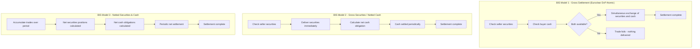

```mermaid
flowchart TD
    %% Model 1 - Euroclear
    subgraph M1["BIS Model 1 - Gross Settlement (Euroclear DvP Atomic)"]
        A1[Check seller securities] --> B1[Check buyer cash]
        B1 --> C1{Both available?}
        C1 -->|Yes| D1[Simultaneous exchange of securities and cash]
        C1 -->|No| E1[Trade fails - nothing delivered]
        D1 --> F1[Settlement complete]
    end

    %% Model 2 - Gross Securities, Netted Cash
    subgraph M2["BIS Model 2 - Gross Securities / Netted Cash"]
        A2[Check seller securities] --> B2[Deliver securities immediately]
        B2 --> C2[Calculate net cash obligation] --> D2[Cash settled periodically]
        D2 --> E2[Settlement complete]
    end

    %% Model 3 - Netted Securities and Cash
    subgraph M3["BIS Model 3 - Netted Securities & Cash"]
        A3[Accumulate trades over period] --> B3[Net securities positions calculated]
        B3 --> C3[Net cash obligations calculated] --> D3[Periodic net settlement]
        D3 --> E3[Settlement complete]
    end
```
