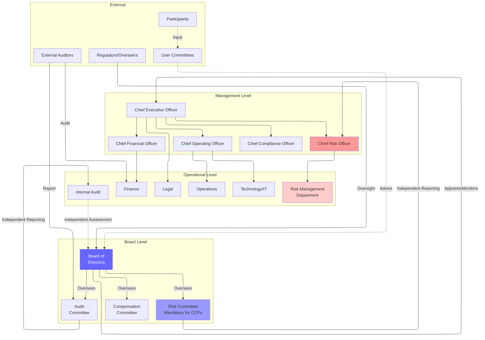

```mermaid
---
config:
  layout: elk
---
flowchart TB
 subgraph subGraph0["Board Level"]
        BOARD["Board of<br>Directors"]
        RISK_C["Risk Committee<br>Mandatory for CCPs"]
        AUDIT_C["Audit<br>Committee"]
        COMP_C["Compensation <br>Committee"]
  end
 subgraph subGraph1["Management Level"]
        CEO["Chief Executive Officer"]
        CRO["Chief Risk Officer"]
        COO["Chief Operating Officer"]
        CFO["Chief Financial Officer"]
        COMP["Chief Compliance Officer"]
  end
 subgraph subGraph2["Operational Level"]
        RISK_M["Risk Management<br>Department"]
        OPS["Operations"]
        IT["Technology/IT"]
        LEGAL["Legal"]
        FIN["Finance"]
        AUDIT_I["Internal Audit"]
  end
 subgraph External["External"]
        PART["Participants"]
        USER_C["User Committees"]
        REG["Regulators/Overseers"]
        EXT_AUD["External Auditors"]
  end
    BOARD -- Appoints/Monitors --> CEO
    BOARD -- Oversees --> RISK_C & AUDIT_C & COMP_C
    RISK_C -- Independent Reporting --> CRO
    AUDIT_C -- Independent Reporting --> AUDIT_I
    CEO --> CRO & COO & CFO & COMP & LEGAL
    CRO --> RISK_M
    COO --> OPS & IT
    CFO --> FIN
    PART -. Input .-> USER_C
    USER_C -. Advice .-> BOARD
    REG -- Oversight --> BOARD
    EXT_AUD -- Audit --> FIN
    EXT_AUD -- Report --> AUDIT_C
    AUDIT_I -. Independent Assessment .-> BOARD
    style BOARD fill:#6666ff,color:#fff
    style RISK_C fill:#9999ff
    style CRO fill:#ff9999
    style RISK_M fill:#ffcccc

```
