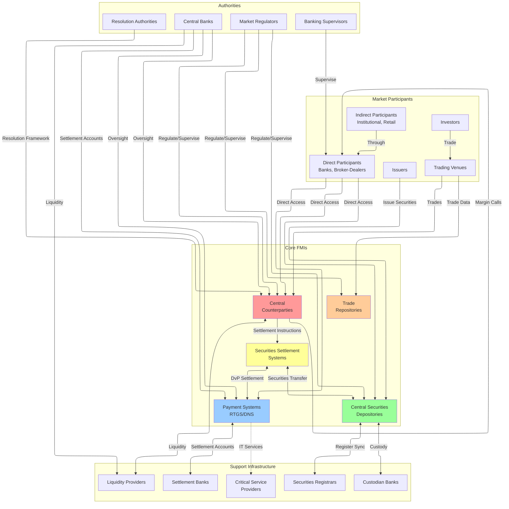

```mermaid
---
config:
  layout: elk
  theme: mc
---
flowchart TB
 subgraph subGraph0["Market Participants"]
        I["Issuers"]
        INV["Investors"]
        TV["Trading Venues"]
        DP["Direct Participants<br>Banks, Broker-Dealers"]
        IP["Indirect Participants<br>Institutional, Retail"]
  end
 subgraph subGraph1["Core FMIs"]
        PS["Payment Systems<br>RTGS/DNS"]
        CSD["Central Securities<br>Depositories"]
        SSS["Securities Settlement<br>Systems"]
        CCP["Central<br>Counterparties"]
        TR["Trade<br>Repositories"]
  end
 subgraph subGraph2["Support Infrastructure"]
        SB["Settlement Banks"]
        CB["Custodian Banks"]
        LP["Liquidity Providers"]
        CSP["Critical Service<br>Providers"]
        SR["Securities Registrars"]
  end
 subgraph Authorities["Authorities"]
        CBANK["Central Banks"]
        MREG["Market Regulators"]
        BSUP["Banking Supervisors"]
        RESA["Resolution Authorities"]
  end
    I -- Issue Securities --> CSD
    INV -- Trade --> TV
    TV -- Trades --> CCP
    TV -- Trade Data --> TR
    CCP -- Settlement Instructions --> SSS
    DP -- Direct Access --> PS & CSD & CCP
    IP -- Through --> DP
    SSS <-- DvP Settlement --> PS
    SSS <-- Securities Transfer --> CSD
    CCP -- Margin Calls --> DP
    PS <-- Settlement Accounts --> SB
    CSD <-- Custody --> CB
    CCP <-- Liquidity --> LP
    PS -. IT Services .-> CSP
    CSD <-- Register Sync --> SR
    CBANK -- Settlement Accounts --> PS
    CBANK -- Liquidity --> LP
    CBANK -- Oversight --> PS & CCP
    MREG -- Regulate/Supervise --> CSD & CCP & TR
    BSUP -- Supervise --> DP
    RESA -- Resolution Framework --> CCP
    style PS fill:#99ccff
    style CSD fill:#99ff99
    style SSS fill:#ffff99
    style CCP fill:#ff9999
    style TR fill:#ffcc99

```
