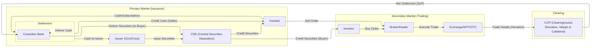

```mermaid
---
config:
  layout: elk
---
flowchart LR
 subgraph subGraph0["Primary Market (Issuance)"]
        Issuer["Issuer (Govt/Corp)"]
        Investor1["Investor"]
        Settlement["Settlement Bank/Payment System"]
        CSD["CSD (Central Securities Depository)"]
  end
 subgraph subGraph1["Secondary Market (Trading)"]
        Investor2["Investor"]
        Broker["Broker/Dealer"]
        Market["Exchange/MTF/OTC"]
  end
 subgraph Clearing["Clearing"]
        CCP["CCP (Clearinghouse)<br>(Novation, Margin &amp; Collateral)"]
  end
 subgraph Settlement["Settlement"]
        Custodian["Custodian Bank"]
  end
    Issuer -- Issue Securities --> CSD
    CSD -- Credit Securities --> Investor1
    Investor1 -- Cash(Subscription) --> Settlement
    Settlement -- Cash to Issuer --> Issuer
    Investor1 -- Sell Order --> Broker
    Investor2 -- Buy Order --> Broker
    Broker -- Execute Trade --> Market
    Market -- Trade Details (Novation) --> CCP
    CCP -- Net Settlement (DvP) --> Custodian
    Custodian -- Deliver Securities (to Buyer) --> CSD
    Custodian -- Deliver Cash --> Settlement
    CSD -- Credit Securities (Buyer) --> Investor2
    Settlement -- Credit Cash (Seller) --> Investor1
```
