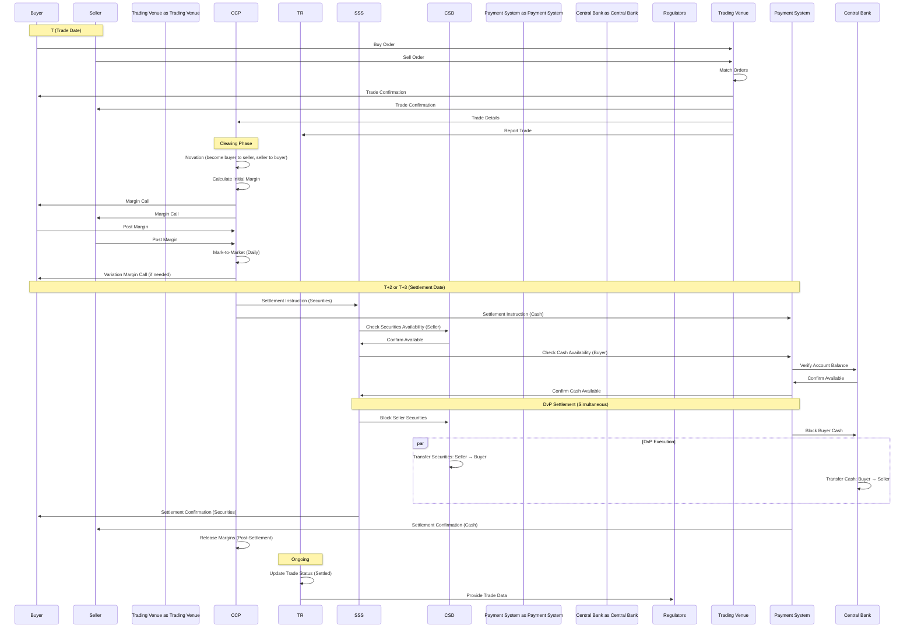

```mermaid
---
config:
  look: neo
---
sequenceDiagram
  participant Buyer as Buyer
  participant Seller as Seller
  participant Trading Venue as Trading Venue
  participant CCP as CCP
  participant TR as TR
  participant SSS as SSS
  participant CSD as CSD
  participant Payment System as Payment System
  participant Central Bank as Central Bank
  participant Regulators as Regulators
  Note over Buyer, Seller: T (Trade Date)
  Buyer ->> Trading Venue: Buy Order
  Seller ->> Trading Venue: Sell Order
  Trading Venue ->> Trading Venue: Match Orders
  Trading Venue ->> Buyer: Trade Confirmation
  Trading Venue ->> Seller: Trade Confirmation
  Trading Venue ->> CCP: Trade Details
  Trading Venue ->> TR: Report Trade
  Note over CCP: Clearing Phase
  CCP ->> CCP: Novation (become buyer to seller, seller to buyer)
  CCP ->> CCP: Calculate Initial Margin
  CCP ->> Buyer: Margin Call
  CCP ->> Seller: Margin Call
  Buyer ->> CCP: Post Margin
  Seller ->> CCP: Post Margin
  CCP ->> CCP: Mark-to-Market (Daily)
  CCP ->> Buyer: Variation Margin Call (if needed)
  Note over Buyer, Payment System: T+2 or T+3 (Settlement Date)
  CCP ->> SSS: Settlement Instruction (Securities)
  CCP ->> Payment System: Settlement Instruction (Cash)
  SSS ->> CSD: Check Securities Availability (Seller)
  CSD ->> SSS: Confirm Available
  SSS ->> Payment System: Check Cash Availability (Buyer)
  Payment System ->> Central Bank: Verify Account Balance
  Central Bank ->> Payment System: Confirm Available
  Payment System ->> SSS: Confirm Cash Available
  Note over SSS, Payment System: DvP Settlement (Simultaneous)
  SSS ->> CSD: Block Seller Securities
  Payment System ->> Central Bank: Block Buyer Cash
  par DvP Execution
    CSD ->> CSD: Transfer Securities: Seller → Buyer
    Central Bank ->> Central Bank: Transfer Cash: Buyer → Seller
  end
  SSS ->> Buyer: Settlement Confirmation (Securities)
  Payment System ->> Seller: Settlement Confirmation (Cash)
  CCP ->> CCP: Release Margins (Post-Settlement)
  Note over TR: Ongoing
  TR ->> TR: Update Trade Status (Settled)
  TR ->> Regulators: Provide Trade Data

```
