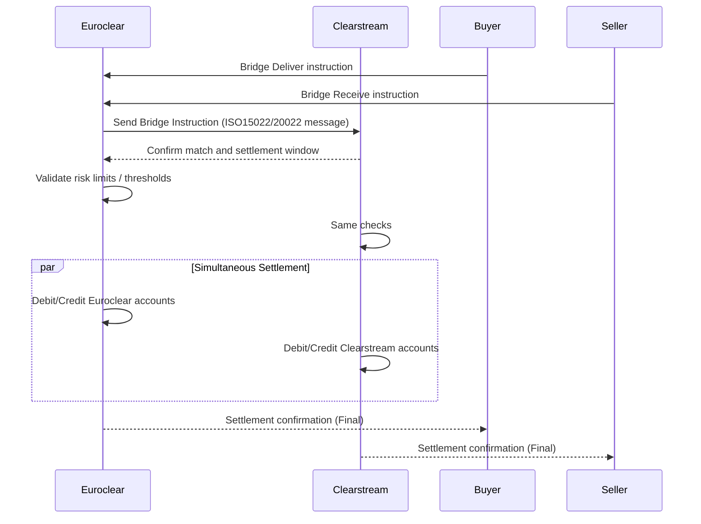

```mermaid
    sequenceDiagram
    participant ECLR as Euroclear
    participant CLST as Clearstream
    participant Buyer
    participant Seller

    Buyer->>ECLR: Bridge Deliver instruction
    Seller->>ECLR: Bridge Receive instruction
    ECLR->>CLST: Send Bridge Instruction (ISO15022/20022 message)
    CLST-->>ECLR: Confirm match and settlement window

    ECLR->>ECLR: Validate risk limits / thresholds
    CLST->>CLST: Same checks

    par Simultaneous Settlement
        ECLR->>ECLR: Debit/Credit Euroclear accounts
        CLST->>CLST: Debit/Credit Clearstream accounts
    end

    ECLR-->>Buyer: Settlement confirmation (Final)
    CLST-->>Seller: Settlement confirmation (Final)
```
