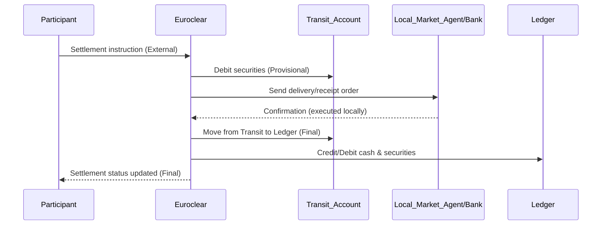

```mermaid
sequenceDiagram
    participant participantA as Participant
    participant Euroclear
    participant Transit as Transit_Account
    participant Market as Local_Market_Agent/Bank
    participant Ledger

    participantA->>Euroclear: Settlement instruction (External)
    Euroclear->>Transit: Debit securities (Provisional)
    Euroclear->>Market: Send delivery/receipt order
    Market-->>Euroclear: Confirmation (executed locally)
    Euroclear->>Transit: Move from Transit to Ledger (Final)
    Euroclear->>Ledger: Credit/Debit cash & securities
    Euroclear-->>participantA: Settlement status updated (Final)
```

