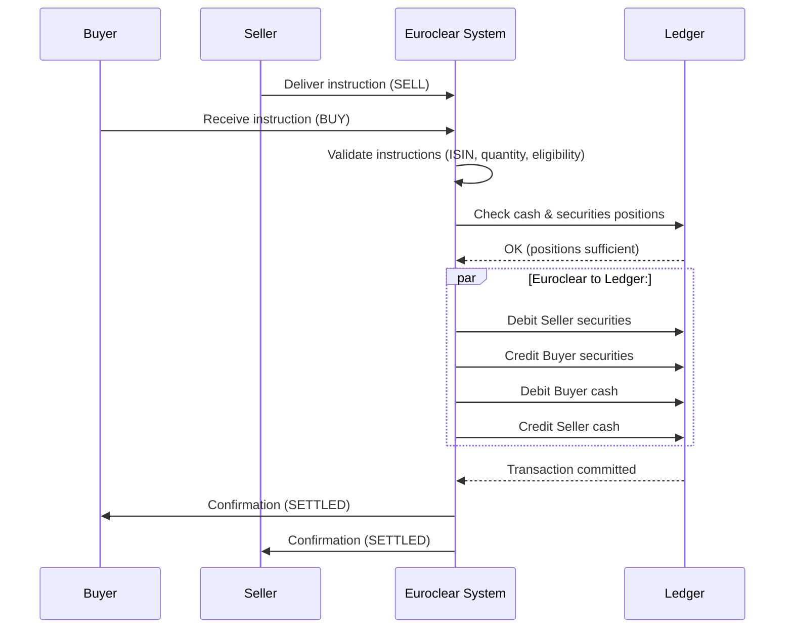

```mermaid
 sequenceDiagram
    participant Buyer
    participant Seller
    participant Euroclear as Euroclear System
    participant Ledger

    Seller->>Euroclear: Deliver instruction (SELL)
    Buyer->>Euroclear: Receive instruction (BUY)
    Euroclear->>Euroclear: Validate instructions (ISIN, quantity, eligibility)
    Euroclear->>Ledger: Check cash & securities positions
    Ledger-->>Euroclear: OK (positions sufficient)

    par Euroclear to Ledger: 
        Euroclear->>Ledger: Debit Seller securities
        Euroclear->>Ledger: Credit Buyer securities
        Euroclear->>Ledger: Debit Buyer cash
        Euroclear->>Ledger: Credit Seller cash
    end


    Ledger-->>Euroclear: Transaction committed
    Euroclear->>Buyer: Confirmation (SETTLED)
    Euroclear->>Seller: Confirmation (SETTLED)
```
